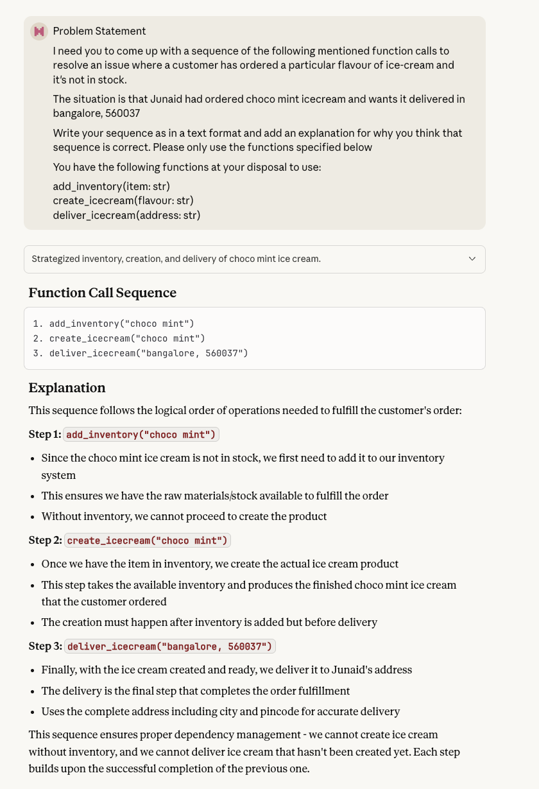
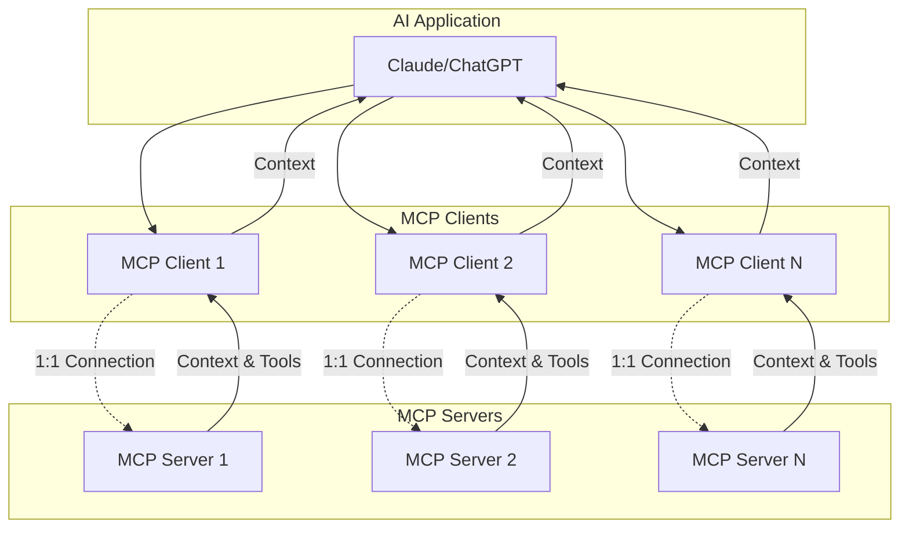
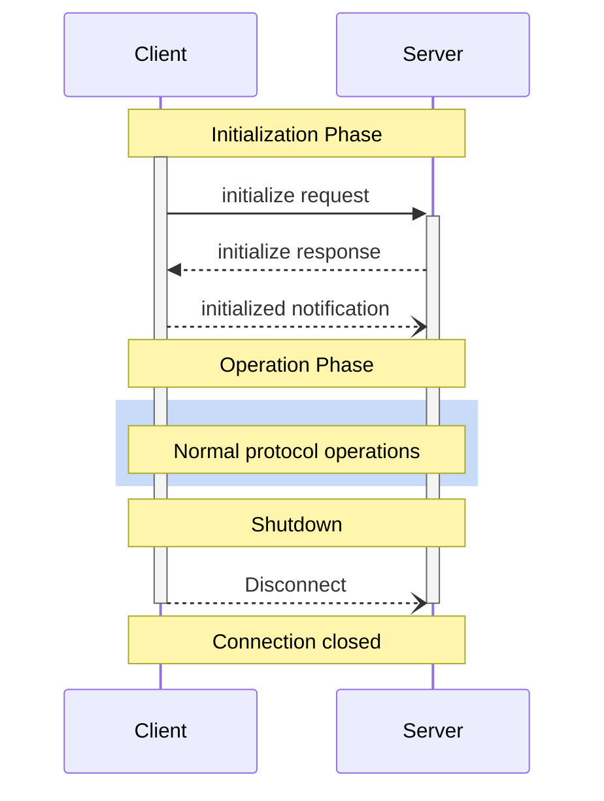
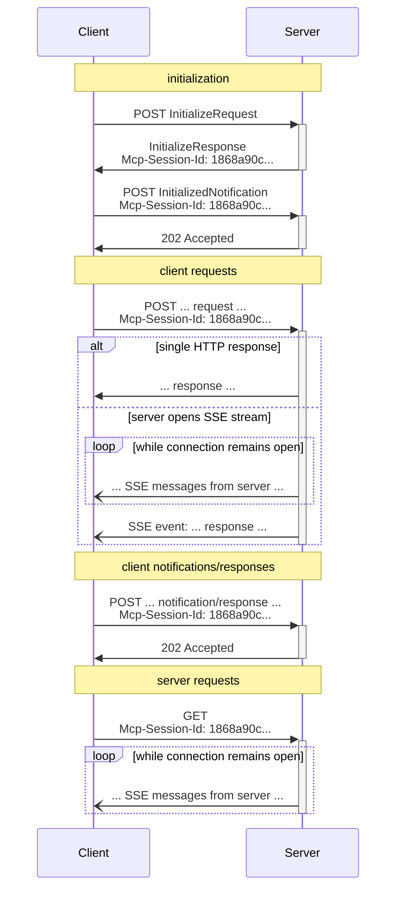

> > This post is a **Work In Progress**.

As you can infer from the title, by the end of this post, you will have a working implementation of the Model Context Protocol (MCP) from scratch.

## About MCP

If you have been following the AI discourse in general, Model Context Protocol (MCP for short) is a star-child of the AI ecosystem. It's the go-to way to let any LLM reach out to existing APIs and services.

If you are familiar with Remote Procedure Call (RPC) in traditional computer science, MCP is just a rebranded version of RPCs. Any seasoned platform engineer would read the MCP specification and go "oh they just rebranded RPCs for the AI era".

An oversimplification would be to say MCP is a way to allow an LLM to interact with what we call a "tool provider" (although the protocol offers a lot more than just tools). A tool provider being some service that offers functions your LLM can use and run to get some work done.

But underneath all the hype, it's just a simple JSON based protocol (preferrably over HTTP/2) to allow LLMs to interact with external tools and services.

And that's what I want to uncover in this piece, is to implement the protocol itself from scratch and reason about it from first principles.

I'll try to build all the ideas and code from scratch, the only pre-requisite knowledege I am assuing you possess is that you have interacted with one of the LLMs -- ChatGPT, Claude, Grok etc.

## Tool Calling and LLMs

If you just open any of the LLM apps and prompt it with the following

```markdown
Problem Statement

I need you to come up with a sequence of the following mentioned function calls
to resolve an issue where a customer has ordered a particular flavour of
ice-cream and it's not in stock.

The situation is that Junaid had ordered choco mint icecream and wants it
delivered in bangalore, 560037.

Write your sequence as in a text format and add an explanation for why you
think that sequence is correct. Please only use the functions specified below

You have the following functions at your disposal to use:

- add_inventory(item: str)
- create_icecream(flavour: str)
- deliver_icecream(address: str)
```



As you can see, your LLM will come with a valid sequence in which you're supposed to call those functions in order to solve the speficied problem.

LLMs with reasoning capabilities are able to solve this sort of situation very well, where they can look at a set of tools/functions/situations and can come up with a logical sequence of actions that solves the problem.

We have an umbrella term for this capability, it's called "tool calling". It's the ability of your LLM to come up with tool sequences with appropriate parameter values to eventually solve any arbitraty problem statement.

The improvement in reasoning capabilities in LLMs happened kind of at a similar time, and around that very time, Anthropic announced the Model Context Protocol (MCP). (TODO: verify this)

The intention of the protocal was to offer a way to formalise what I just showed you in the above example, a way to have an agreed-upon structure in which you could tell an LLM that "hey these are the tools you have at your disposal" and for the LLM to request the actual execution of those tools.

## MCP Overview

MCP (Model Context Protocol) is an open-source standard for connecting AI applications to external systems.

Using MCP, AI applications like Claude or ChatGPT can connect to data sources (e.g. local files, databases), tools (e.g. search engines, calculators) and workflows (e.g. specialized prompts)—enabling them to access key information and perform tasks.

Think of MCP like a USB-C port for AI applications. Just as USB-C provides a standardized way to connect electronic devices, MCP provides a standardized way to connect AI applications to external systems.

### Clients and Servers

MCP follows a client-server architecture where an MCP host — an AI application like Claude Code or Claude Desktop — establishes connections to one or more MCP servers.

The MCP host accomplishes this by creating one MCP client for each MCP server. Each MCP client maintains a dedicated one-to-one connection with its corresponding MCP server.

The key participants in the MCP architecture are:

- MCP Host: The AI application that coordinates and manages one or multiple MCP clients
- MCP Client: A component that maintains a connection to an MCP server and obtains context from an MCP server for the MCP host to use
- MCP Server: A program that provides context to MCP clients



## MCP Server Decomposition

MCP Clients talk to MCP Servers in a standardized format over a specific protocol.

MCP uses [JSON-RPC 2.0](https://www.jsonrpc.org/specification) as it's serialization standard, which is a JSON based standard to perform client-server operations with RPC-like servers.

These JSON-RPC messages can be sent over to a MCP server via the following transport protocols

- `stdio` - For local instances and development.
- `Streamable HTTP` - For web based interactions.

Just like most client-server protocols, MCP also follows a well-defined lifecycle.



We'll unwrap this entire lifecycle with specific methods in a while, but let's understand JSON-RPC and the Transport methods in depth.

### JSON-RPC

JSON RPC is the serialization format used by MCP.

It's a very simple standard that you can use for RPC like operations. The protocol is so small and simple that it could easily fit on an index card.

The protocol defines two kinds of objects -- **Request** and **Response**.

- Request: A rpc call is represented by sending a Request object to a Server
- Response: When a rpc call is made, the Server MUST reply with a Response, except for in the case of Notifications

Schema of a `Request` Object

- `jsonrpc`
  - A String specifying the version of the JSON-RPC protocol. MUST be exactly "2.0".
- `method`
  - A String containing the name of the method to be invoked. Method names that begin with the word rpc followed by a period character (U+002E or ASCII 46) are reserved for rpc-internal methods and extensions and MUST NOT be used for anything else.
- `params`
  - A Structured value that holds the parameter values to be used during the invocation of the method. This member MAY be omitted.
- `id`
  - An identifier established by the Client that MUST contain a String, Number, or NULL value if included. If it is not included it is assumed to be a notification. The value SHOULD normally not be Null and Numbers SHOULD NOT contain fractional parts.

Example:

```json
{ "jsonrpc": "2.0", "method": "subtract", "params": [42, 23], "id": 1 }
```

Schema of a `Response` Object

- `jsonrpc`
  - A String specifying the version of the JSON-RPC protocol. MUST be exactly "2.0".
- `result`
  - This member is REQUIRED on success. This member MUST NOT exist if there was an error invoking the method. The value of this member is determined by the method invoked on the Server.
- `error`
  - This member is REQUIRED on error. This member MUST NOT exist if there was no error triggered during invocation. The value for this member MUST be an Object as defined in section 5.1.
- `id`
  - This member is REQUIRED. It MUST be the same as the value of the id member in the Request Object. If there was an error in detecting the id in the Request object (e.g. Parse error/Invalid Request), it MUST be Null. Either the result member or error member MUST be included, but both members MUST NOT be included.

Example:

```json
{ "jsonrpc": "2.0", "result": 19, "id": 1 }
```

### Transport

### stdio

The `stdio` (standard input/output) streams are a core part of Unix systems. Every process gets three default file descriptors:

- **stdin** (standard input, usually file descriptor 0): where a process reads input, typically from the keyboard or another program.
- **stdout** (standard output, file descriptor 1): where a process writes its output, usually displayed on the terminal or piped to another process.
- **stderr** (standard error, file descriptor 2): used for error messages and diagnostics, separate from regular output.

These streams enable simple, composable communication between programs. Tools can be chained together using pipes, allowing the output of one process to become the input of another. This model is foundational for building flexible, scriptable workflows in Unix environments.

### Streamable HTTP

In the Streamable HTTP transport, the server operates as an independent process that can handle multiple client connections. This transport uses HTTP POST and GET requests.

Server can optionally make use of Server-Sent Events (SSE) to stream multiple server messages. This permits basic MCP servers, as well as more feature-rich servers supporting streaming and server-to-client notifications and requests.

The server MUST provide a single HTTP endpoint path (hereafter referred to as the MCP endpoint) that supports both POST and GET methods. For example, this could be a URL like https://example.com/mcp.

If the MCP server is using Server-Sent Events (SSE), then it's advised to implement it over HTTP/2 for performance reasons.

When not used over HTTP/2, SSE suffers from a limitation to the maximum number of open connections, which can be especially painful when opening multiple tabs, as the limit is per browser and is set to a very low number (6).

When using HTTP/2, the maximum number of simultaneous HTTP streams over a single TCP connection is negotiated between the server and the client (defaults to 100).


