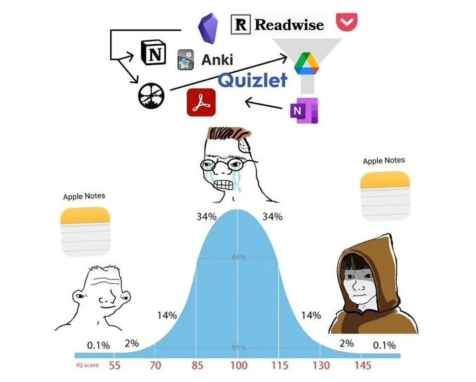

*Productivity Porn* -- engaging in activities that create an illusion of productivity without actual work. 

Binge-watching videos on how to be productive, obsessing over the perfect productivity setup, watching too many motivational vidoes and reading too many self-help books. Ultimately hindering real progress.

A very similar thing happens when you go too deep into the sub-culture of using [Notion](https://notion.so/). This is what I'd like to call the **Notion Industrial Complex**.

## Notion Industrial Complex

> The industrial complex is a socioeconomic concept wherein businesses become entwined in social or political systems or institutions, creating or bolstering a profit economy from these systems
>
> -- [wikipedia](https://en.wikipedia.org/wiki/Industrial_complex)

Notion started off as a fresh take on word documents and the personal productivity people absolutely ate it. We went from thinking of notes as a collection of pages to a database of pages that link to each other.

It was like you could build your own app to manage your notes, link them in all the fancy ways, build dashboard-esque home pages for all your tasks and so on.

Notion seems to be going after the google workspace business these days with the [cron](https://www.notion.so/blog/notion-acquires-cron) and [skiff](https://techcrunch.com/2024/02/09/notion-acquires-privacy-focused-productivity-platform-skiff/) acquisitions.

> Every program attempts to expand until it can read mail. Those programs which cannot so expand are replaced by ones which can.
>
> -- [Zawinski’s Law](https://modelthinkers.com/mental-model/zawinskis-law#:~:text=Zawinski's%20Law%20captures%20common%20market,replaced%20by%20ones%20which%20can.%E2%80%9D)

But this is not about them as a company or their tech, it's a very impressive product. 

This is about notion's cultural presence in the personal productivity space. Productivity porn and Notion are a match made in heaven. I like to call it the Notion Industrial Complex. 

If you have used notion in any capacity to manage your personal notes, you might have realised how it is designed to lure you into using all of its features to make your workspace as complicated as possible, you might start with simple pages and backlinks, but then you try databases, and linked databases, and then reminders and then filters and formulae and you realise you have spent the last 4 hours doing everything on notion apart from the one thing you opened it for, to write.

Apart from this, there is a full cadre of content creators on all the platforms you can imagine who create very cute playlists and guides on how you can hit your nirvana notion workspace. They might also convince you to buy one of their templates. [Even I have done it](https://junaidrahim.gumroad.com/l/notion-for-devs?a=590092627). 

You see what I mean ?

I started using notion when it was in beta, I still use it for my day job, but I don't use it anymore to manage my personal notes and tasks, I have moved to a radically simpler setup to just use [obsidian](https://obsidian.md/) and [todoist](https://todoist.com/).

I was a part of the notion industrial complex, I always thought that I was just another notion re-org away from hitting my perfect productivity setup, because everyone was selling that narrative, some of them were paid to sell that narrative by Notion. 

I used to spend hours making my notion pretty and organised. I used to religiously follow creators on yt that would keep coming up with new videos of elaborate setups to organise notes, projects, goals, tasks, milestones, reminders.

It is very easy to fall prey to all this and forget that the whole point of this system is to enable you to close more tasks. Anything that gets in the way of this one outcome is just noise.

## Signal Density over Illusionary Metadata

One of my favourite advice I received from a manager was to "stop starting and start closing". And I have taken this line to heart when it comes to productivity and output in general.

The only way to perform is to pick a few tasks every day and lock-in until you close them. Rather than keep building elaborate information hierarchies of things you're supposed to do, doing, and have done.

Action creates information, motion causes motivation, execution is the only thing that eventually matters. You don't have to build perfect systems that capture all kinds of metadata about your tasks so you can keep feeling good about how you are making informed decisions about your tasks.

Setting up elaborate systems to capture task metadata consumes time better spent on actual work, which yields more actionable, signal-dense data. Your system should evolve to provide more singal-dense metadata about your tasks, rather than illusionary metadata that looks pretty in a system.

And if you're one of those people who is creating a pretty notion to post about it on pintrest or tiktok, please discard everything I just said, you are too deep in the notion industrial complex anyway.
