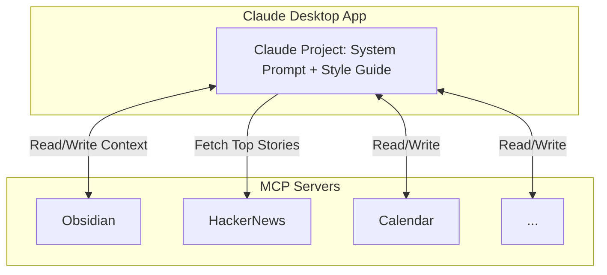

>> WIP Post. Not Ready

This guide covers how I’ve setup a practical personal executive assistant using the Claude desktop app and Obsidian MCP. 

The core idea: connect Claude to your universe of notes and tools, so it can read, write, and reason with your real context—not just isolated prompts.

My setup uses multiple MCPs servers to extend Claude’s reach:

- Obsidian MCP for my notes vault (core context layer)
- Google Calendar MCP for scheduling and time management
- HackerNews MCP for news and research feeds

You don’t need all of these to get started. The essential workflow works with just the Obsidian MCP server. 

If you already have a populated Obsidian vault, this approach unlocks a lot of value—Claude can reference, summarize, and update your notes directly.

What if you’re new to Obsidian? This setup still works. 

Even a small vault gives Claude a foundation to build on. As you add more notes, the assistant becomes more useful—context compounds over time.

Who should use this guide?

- Claude users who rely on note-taking tools to organize work and life
- Anyone looking to automate workflows across multiple tools like notes, calendar, and research feeds etc.

Start with Obsidian MCP for the fastest path. Expand to other MCPs as your needs grow. The assistant’s value scales with your context.

## How It Works



To make Claude a truly effective personal assistant, you need to give it two core ingredients: a system prompt and a style guide. Each serves a distinct purpose in shaping how the assistant operates and interacts with your context.

The system prompt is the foundation. It defines the assistant’s personality, its operating principles, and the boundaries for how it should behave. Think of it as the act of designing the personality for your assistant. 

With a well-crafted system prompt, you can:

- Specify the assistant’s tone (e.g., direct, friendly, formal, concise)
- Set clear rules for how it should handle information (privacy, summarization, prioritization)
- Define the types of tasks it should focus on (e.g., summarizing notes, drafting emails, managing to-dos)
- Establish boundaries for what it should and shouldn’t do

For example, you might instruct Claude to always prioritize actionable insights, avoid unnecessary pleasantries, and use markdown formatting for all outputs. 

You can also tailor the prompt to reflect your working style—whether you want the assistant to challenge your assumptions, ask clarifying questions, or just execute tasks quietly.

The style guide is the second layer. While the system prompt sets the “what” and “why,” the style guide handles the “how.” 

It codifies your unique writing style, so the assistant can generate content that sounds like you. This is critical for making outputs feel natural and reducing the “AI-generated” vibe.

A good style guide covers:

- Sentence structure (short, direct, or more elaborate)
- Preferred vocabulary and technical terms
- Formatting conventions (bullet points, headers, code blocks)
- Voice and tone for different contexts (e.g., Slack messages vs. Long form documentation)

By combining a strong system prompt with a detailed style guide, you create an assistant that not only understands your context but also communicates in a way that matches your personal, professional and unhinged standards.

## Setup

Let's walk through a setup guide for this personal executive assistant.

### Install Claude

Download the Claude desktop app from [here](https://claude.ai/download).

The feature we will be using is [Claude Projects](https://www.anthropic.com/news/projects) and its ability to talk to MCP servers.

### Install Obsidian MCP

You can follow the instructions to setup a obsidian MCP server [here](https://github.com/MarkusPfundstein/mcp-obsidian?tab=readme-ov-file#quickstart).

### Install Other MCPs

You can install some other MCPs as well based on the tools you use in your day to day.

If there is a tool you feel that your assistant would constantly need to talk to, you can set that up as well.

- I use the google calendar MCP to help it pull my upcoming meetings.
- I use the hackernews MCP to pull the top 5 posts first thing every morning.

I'll leave the rest to your imagination, you can browse [MCP marketplaces](https://mcpmarket.com/) to figure out other MCPs you'd want to add.

### System Prompt

This is the meat of the system.

### Writing Style Guide (Optional)

The next thing you'd want is a personalised writing style guide.

This is how you solve the problem of _"this looks AI generated"_.

This is completely optional but its one of the things that will make your personal assistant very sticky, you'll start coming back to this claude project multiple times a day.

A writing style guide basically tells Claude how to "sound" like you.

The observation was that most people have different formats or voices in which we write things. The way I write messages on slack or write my emails is very different compared to what I sould like in a long-form software architecture document.

And having an assistant that can sound like you is a major unlock, all the throwaway writing we do day to day becomes a breeze.

Please note that this is not the guide to make claude respond to you in a certain tone in the chats, honestly I didn't really care much about the tone in which it responds to me in chats.

But I really wanted a way to prompt claude to "write about `<x>` in my tone and sentence structure" and want it to do a good job.

You can write this writing style guide manually if you can articulate your writing style. The easier way to do this is to collect a variety of your writing samples -- emails, slack messages, documents, journal entries etc. and ask claude to analyze it and give you a style guide. You can iterate on this



```markdown
Analyze the provided writing samples to create a concise personal writing style guide that captures how this person adapts their voice across different communication contexts.

## Input Materials

Writing samples across various contexts:

- Slack messages/casual chat
- Professional emails
- Technical documentation
- Long-form articles
- Meeting notes
- Reflective writing/journaling

## Core Analysis Areas

### 1. Voice Characteristics by Context

For each writing type, identify:

- **Formality level** (casual → professional spectrum)
- **Sentence patterns** (length, complexity, fragments vs. complete)
- **Signature phrases** and verbal tics
- **Emotional tone** (enthusiastic, measured, analytical)

### 2. Structural Patterns

- How ideas are introduced and concluded
- Paragraph and section organization
- Use of lists vs. prose
- Transition words and connectors

### 3. Stylistic Markers

- Punctuation preferences (em-dashes, semicolons, exclamation points)
- Emphasis techniques (bold, italics, CAPS, "quotes")
- Questions patterns (rhetorical, direct, softened)
- Uncertainty expressions ("perhaps", "might", "I think")

## Output Format

Create a comprehensive style guide covering the following sections

- Executive Summary: One paragraph capturing essential writing personality
- Slack/Chatatterns\*\*: message length, emoji usage, greeting style
- Email patterns: subject lines, openings, closings, formality shifts
- Technical writing: documentation depth, example usage, jargon level
- Long-formtyle\*\*: hooks, evidence presentation, narrative flow
- Signature phrases: 5-10 most frequent across contexts
- Unique quirks: punctuation habits, formatting preferences, vocabulary choices
- Voice rules: 5 key patterns (e.g., "uses 'folks' not 'everyone'", "softens criticism with questions")
- Formality scale: Rate 1-5 for each context type
- Common transitions: Top 5 connecting phrases
- Conclusion patterns: Top 3 ways of ending communications
- Do's: Patterns consistently present
- Don'ts: Patterns consistently avoided
- Context shifts: How style changes for leadership vs. peers vs. reports

## Analysis Instructions

1. Identify patterns appearing 3+ times
2. Note deliberate style shifts between contexts
3. Focus on actionable, replicable patterns
4. Provide specific examples from samples
5. Highlight what makes this voice distinctive

Generate a style guide that enables accurate replication of this person's voice while maintaining natural, context-appropriate communication.
```



### Prompting

> Add a screenshot here

## My Experience

I'll just share my story and experience here from using this setup for the past few months.

1. It's very sticky.
2. Morning routine details.

---

**Notes**

- Special thanks to [Priyansi]() and [Shubhankar](https://x.com/KhareShubhankar) for reading drafts of this post and helping me out.
