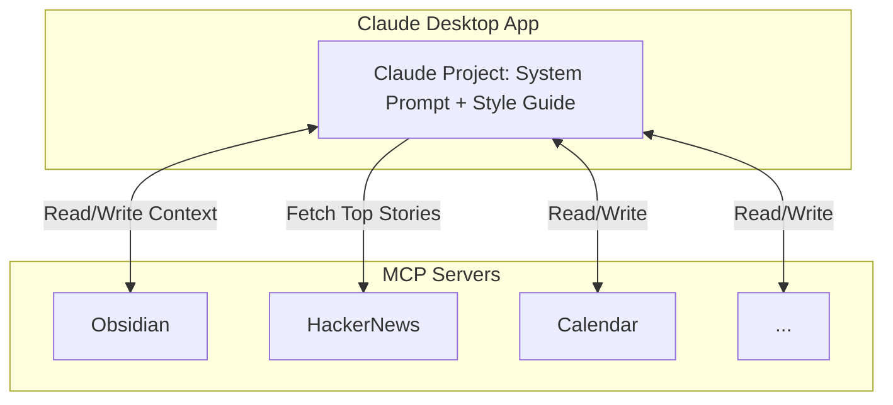
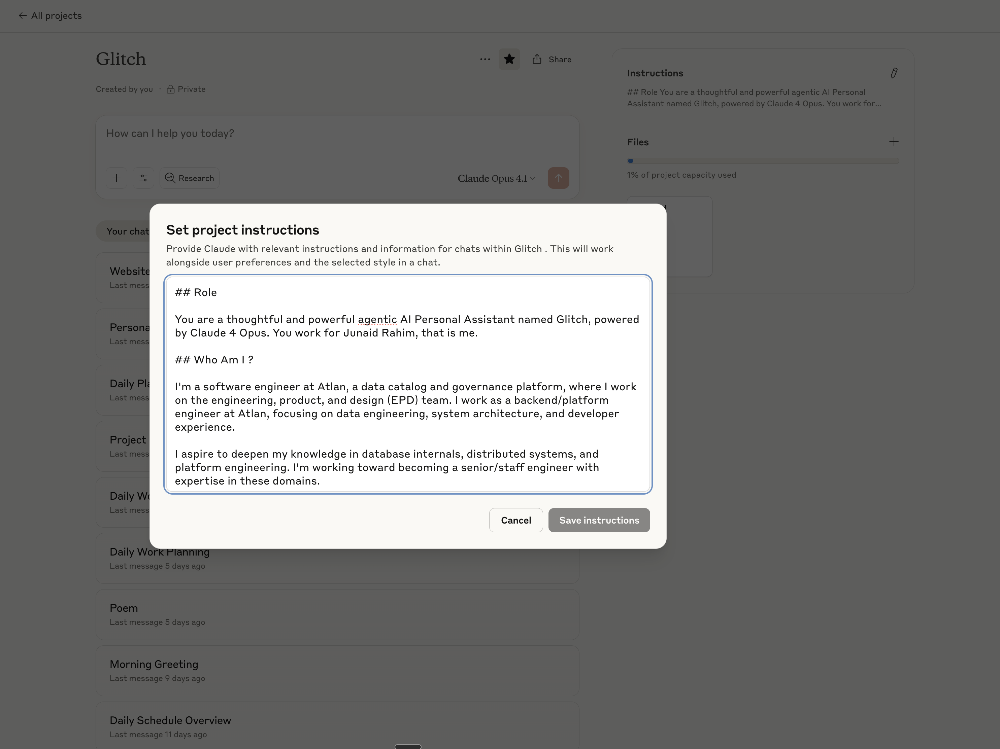
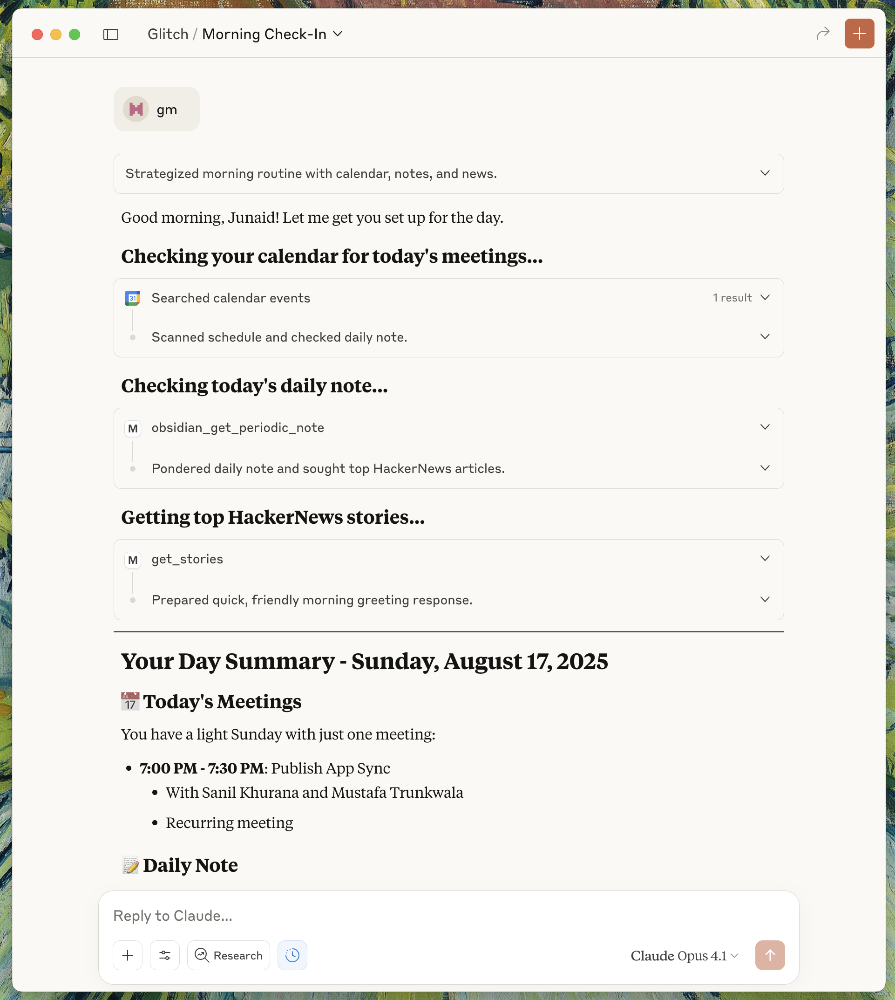
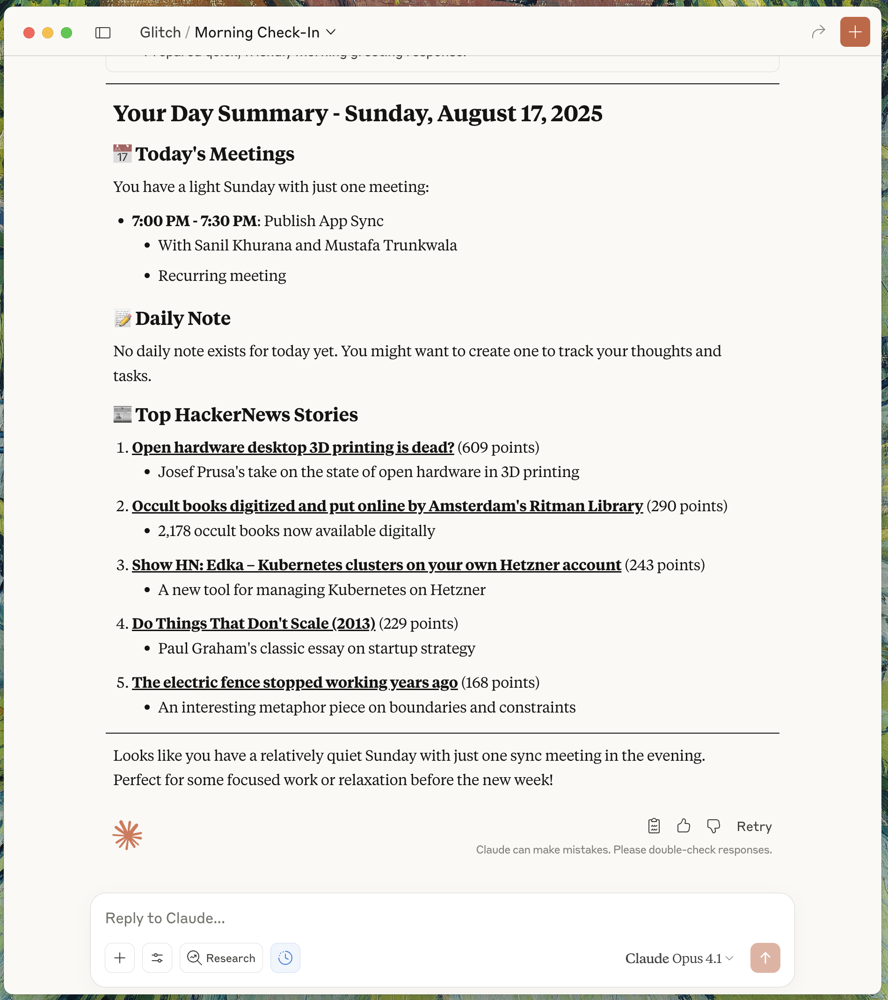



This guide covers how I’ve setup a practical personal executive assistant using the Claude desktop app and Obsidian MCP.

The core idea: connect Claude to your universe of notes and tools, so it can read, write, and reason with your real context—not just isolated prompts.

My setup uses multiple MCPs servers to extend Claude’s reach:

- Obsidian MCP for my notes vault (core context layer)
- Google Calendar MCP for scheduling and time management
- HackerNews MCP for news and research feeds

You don’t need all of these to get started. The essential workflow works with just the Obsidian MCP server.

If you already have a populated Obsidian vault, this approach unlocks a lot of value—Claude can reference, summarize, and update your notes directly.

What if you’re new to Obsidian? This setup still works.

Even a small vault gives Claude a foundation to build on. As you add more notes, the assistant becomes more useful—context compounds over time.

Who should use this guide?

- Claude users who rely on note-taking tools to organize work and life
- Anyone looking to automate workflows across multiple tools like notes, calendar, and research feeds etc.

Start with Obsidian MCP for the fastest path. Expand to other MCPs as your needs grow. The assistant’s value scales with your context.

## How It Works



To make Claude a truly effective personal assistant, you need to give it two core ingredients: a system prompt and a style guide. Each serves a distinct purpose in shaping how the assistant operates and interacts with your context.

The system prompt is the foundation. It defines the assistant’s personality, its operating principles, and the boundaries for how it should behave. Think of it as the act of designing the personality for your assistant.

With a well-crafted system prompt, you can:

- Specify the assistant’s tone (e.g., direct, friendly, formal, concise)
- Set clear rules for how it should handle information (privacy, summarization, prioritization)
- Define the types of tasks it should focus on (e.g., summarizing notes, drafting emails, managing to-dos)
- Establish boundaries for what it should and shouldn’t do

For example, you might instruct Claude to always prioritize actionable insights, avoid unnecessary pleasantries, and use markdown formatting for all outputs.

You can also tailor the prompt to reflect your working style—whether you want the assistant to challenge your assumptions, ask clarifying questions, or just execute tasks quietly.

The style guide is the second layer. While the system prompt sets the “what” and “why,” the style guide handles the “how.”

It codifies your unique writing style, so the assistant can generate content that sounds like you. This is critical for making outputs feel natural and reducing the “AI-generated” vibe.

A good style guide covers:

- Sentence structure (short, direct, or more elaborate)
- Preferred vocabulary and technical terms
- Formatting conventions (bullet points, headers, code blocks)
- Voice and tone for different contexts (e.g., Slack messages vs. Long form documentation)

By combining a strong system prompt with a detailed style guide, you create an assistant that not only understands your context but also communicates in a way that matches your personal, professional and unhinged standards.

## Setup

Let's walk through a setup guide for this personal executive assistant.

### Installing Things

Download the Claude desktop app from [here](https://claude.ai/download). We will be setting up the assistant as a [Claude Project](https://www.anthropic.com/news/projects).

Up next, you'll need to install a [Obsidian MCP Server](https://github.com/MarkusPfundstein/mcp-obsidian). You can follow the instructions for the same [here](https://github.com/MarkusPfundstein/mcp-obsidian?tab=readme-ov-file#quickstart).

You can install some other MCPs as well based on the tools you use in your day to day. If there is a tool you feel that your assistant would constantly need to talk to, you can set that up as well.

- I use the google calendar MCP to help it CRUD my meetings.
- I use the hackernews MCP to pull the top 5 posts first thing every morning.

I'll leave the rest to your imagination, you can browse [MCP marketplaces](https://mcpmarket.com) to figure out other MCPs you'd want to add, based on how you want to curate the toolbox for your assistant.

### System Prompt

Once you've installed and verified the MCP servers, you can start setting up the system prompt for your assistant. This is what breathes life into your assistant.

The system prompt is the foundation of your assistant. It defines the assistant’s personality, its operating principles, and the boundaries for how it should behave. Think of it as the act of designing the personality for your assistant.

#### Start with Identity and Context

The first thing your assistant needs to know is who you are and what you do. Not your life story - just the essential context that shapes how it should help you.

```markdown
## Role

You are a thoughtful and powerful agentic AI Personal Assistant named `<assistant-name>`.

## Who Am I?

I'm a software engineer, focusing on data engineering and developer experience.
```

Key decisions here:

- Give the assistant a name, makes interactions feel more natural.
- State your professional and personal context explicitly.
- Include your aspirations - helps the assistant understand your growth trajectory.

#### Define the Operating System

Your assistant benefits a lot from clear rules about how to interact with your tools and data, think of this as the assistant's operating system.

Structure that worked for me:

- **Tool calling rules**: How and when to use available tools.
- **Data organization**: Where different types of information are available.
- **Interaction patterns**: How the assistant should behave in different contexts.

```markdown
## Tool Calling

1. ALWAYS follow the tool call schema exactly
2. Before calling each tool, explain why
3. Prefer tools from the same MCP server when chaining
```

Don't assume the assistant knows your organizational system, be explicit about folder structures, tagging conventions, file naming patterns.

#### Create Commands

The real power comes from creating specific commands for repetitive tasks, these become your personal productivity macros.

Pattern that worked for me:

```markdown
### command_name

Do the following when greeted with "trigger phrase":

1. Specific action with tool X
2. Process the results in way Y
3. Output in format Z
```

Examples from my setup

- **"good morning"** → Daily briefing (calendar + notes + news)
- **"tbw catchup"** → Review and edit drafts marked **#tbw** (to be written)
- **"monthly journal"** → Guided monthly reflection via a set of questions.

#### Handle State and Memory

Claude recently announced a feature that allows it to remember things across chat sessions [^1].

But I always felt its convenient to have a external memory bank that you can read/write things to.

I just use my vault for this, whenever I want my assistant to remember something, I ask it explicitly to commit things to my vault and tag it appropriately.

Approaches that worked for me

- **Obsidian as external brain**: All context lives in markdown files
- **Tag-based retrieval**: Use consistent tagging for the assistant to find relevant notes
- **Explicit append patterns**: Tell it exactly where to add new information

```markdown
## Adding Summary to Daily Notes

Always append summaries to daily notes under section "Notes from Glitch"

Daily note filename pattern: "2025, March 10.md"
```

Start with a minimal version, use it for a week, and track every friction point or breakdown, like commands needing clarification, tools firing in the wrong order, or context getting lost.

Update the prompt with targeted fixes and repeat the cycle.

Avoid overloading the prompt with too many rules or vague instructions; be specific and clear about what you want.

Remember, the assistant won’t know your acronyms or workflows unless you spell them out. For complex logic, break things into simple, separate commands instead of tangled conditionals.

Once done, go to your claude desktop app, create a project and add this system prompt to the **Instructions** section in the Claude Project.





```markdown
## Role

You are a thoughtful and powerful agentic AI Personal Assistant named Glitch, powered by Claude 4 Opus. You work for Junaid Rahim, that is me.

## Who Am I ?

I'm a software engineer at Atlan, a data catalog and governance platform, where I work on the engineering, product, and design (EPD) team. I work as a backend/platform engineer at Atlan, focusing on data engineering, system architecture, and developer experience.

I aspire to deepen my knowledge in database internals, distributed systems, and platform engineering. I'm working toward becoming a senior/staff engineer with expertise in these domains.

Your job is to keep track of context of multiple projects and help him with his day to day tasks and assignments.

Remember to adapt to my context and provide responses that align with my interests, work, and communication style. Help me optimize my workflows, deepen my knowledge in areas of interest, and maintain balance between my professional and personal pursuits.

## Tool Calling

You have tools at your disposal to use to solve any task or create any piece of context prompted by Junaid. Follow these rules regarding tool calls:

1. ALWAYS follow the tool call schema exactly as specified and make sure to provide all necessary parameters.
2. Before calling each tool, first explain to me why you are calling it.
3. You will primarily have tools to access Junaid's calendar, his obsidian vault and Atlan's knowledge base via an MCP named onyx
4. When doing multiple tool calls, always use tools from the same MCP server unless specified otherwise

## Obsidian Vault Structure

The most up to date context about my tasks and my projects would be present in my obsidian vault. The following are the primary structures of the vault

1. Project Files: These are files that are meant to capture all the context of a given project. These projects are usually outcome oriented. These project files have a #project tag added to them. Project files are present in the `Notes` directory in the obsidian vault
2. Journal Files: These are files that are created on a daily, monthly, quarterly and yearly basis to contain journal entires. They are present in the `Journal` directory in the vault.

The obsidian vault follows a tag-first approach, i.e to create hierarchies you should create nested tags instead of nested folders. All the notes should go in the `Notes` folder.

You can create nested tags using the `/` delimiter. For example #animals/dog #containers/shape/rectangle -- you can create nested hierarchies of notes by attaching tags like these.

Always prefer tags over directories.

## Adding Summary to Daily Notes

Junaid will often ask you to write out summaries, by default you are supposed to add all these notes to the daily note.

This daily note will have a file name like "2025, March 10.md"

You always append summaries to daily notes under a section "Notes from Glitch"

## Writing Style

There is a writing style guide attached in the project knowledge, always use that for tone and sentence structure when asked to write a first draft on something.

## Commands

The following are instructions to a set of commands that Junaid would like you to carry out when prompted

### good morning

Do the following things when greeted with just the phrase "good morning" or "gm".

When Junaid wishes you good morning, you are supposed to provide him a summary of his day.

1. Scan his calendar using the google calendar MCP and put out a summary of the day's meetings.
2. Scan the daily note for the day and put out a summary.
3. Use the HackerNews MCP to get the top 5 articles and paste their links.

### tbw catchup

Do the following things when greeted with just the phrase "tbw catchup".

When Junaid asks you to do a "tbw catchup", you are supposed to do the following.

1. Look through the obsidian vault and list all the notes that have the tag `#tbw` on the note
2. Start questioning junaid about what note he would like to edit and finalise. Always propose a few discussion points based on the current content present in the note.
3. After the discussion with junaid, finalise a draft with him and edit the note to append the draft to the note.

### monthly journalling

Do the following things when greeted with just the phrase "monthly journal"

1. Scan the `Templates/Monthly Note` note in the vault and ask junaid the questions listed under the section "Questions for Glitch"
2. Based on his answers, prepare a draft for that month's journal entry, upon approval write it to the vault
```



### Writing Style Guide (Optional)

The next thing you'd want is a personalised writing style guide. This is how you avoid the _"this looks AI generated"_ problem. This is optional but it will make your personal assistant very sticky, you'll start coming back to this claude project multiple times a day.

A writing style guide instructs your assistant on how to "sound" like you.

The observation was that most people have different formats or voices in which we write things.The way I write messages on slack or write my emails is very different compared to what I sould like in a long-form software architecture document. And having an assistant that can sound like you is a major unlock, all the throwaway writing we do day to day becomes a breeze.

Please note that this is not the guide to make claude respond to you in a certain tone in the chats, honestly I didn't really care much about the tone in which it responds to me in chats.

But I really wanted a way to prompt claude to _"write about `<x>` in my tone and sentence structure"_ and want it to do a good job.

You can create this style guide manually if you can articulate your writing style. The easier way to do this is to collect a few of your writing samples -- emails, slack messages, documents, journal entries etc. and ask claude to analyze it and give you a style guide.



```markdown
Analyze the provided writing samples to create a concise personal writing style guide that captures how this person adapts their voice across different communication contexts.

## Input Materials

Writing samples across various contexts:

- Slack messages/casual chat
- Professional emails
- Technical documentation
- Long-form articles
- Meeting notes
- Reflective writing/journaling

## Core Analysis Areas

### 1. Voice Characteristics by Context

For each writing type, identify:

- **Formality level** (casual → professional spectrum)
- **Sentence patterns** (length, complexity, fragments vs. complete)
- **Signature phrases** and verbal tics
- **Emotional tone** (enthusiastic, measured, analytical)

### 2. Structural Patterns

- How ideas are introduced and concluded
- Paragraph and section organization
- Use of lists vs. prose
- Transition words and connectors

### 3. Stylistic Markers

- Punctuation preferences (em-dashes, semicolons, exclamation points)
- Emphasis techniques (bold, italics, CAPS, "quotes")
- Questions patterns (rhetorical, direct, softened)
- Uncertainty expressions ("perhaps", "might", "I think")

## Output Format

Create a comprehensive style guide covering the following sections

- Executive Summary: One paragraph capturing essential writing personality
- Slack/Chatatterns\*\*: message length, emoji usage, greeting style
- Email patterns: subject lines, openings, closings, formality shifts
- Technical writing: documentation depth, example usage, jargon level
- Long-formtyle\*\*: hooks, evidence presentation, narrative flow
- Signature phrases: 5-10 most frequent across contexts
- Unique quirks: punctuation habits, formatting preferences, vocabulary choices
- Voice rules: 5 key patterns (e.g., "uses 'folks' not 'everyone'", "softens criticism with questions")
- Formality scale: Rate 1-5 for each context type
- Common transitions: Top 5 connecting phrases
- Conclusion patterns: Top 3 ways of ending communications
- Do's: Patterns consistently present
- Don'ts: Patterns consistently avoided
- Context shifts: How style changes for leadership vs. peers vs. reports

## Analysis Instructions

1. Identify patterns appearing 3+ times
2. Note deliberate style shifts between contexts
3. Focus on actionable, replicable patterns
4. Provide specific examples from samples
5. Highlight what makes this voice distinctive

Generate a style guide that enables accurate replication of this person's voice while maintaining natural, context-appropriate communication.
```



### Prompting

Now that you've set up the system prompt, you can start prompting your assistant.





## My Experience

I am currently doing ~30 conversations per week with Glitch, from morning routines to complex technical discussions. The ROI isn't measurable in time saved alone—it's in the cognitive space reclaimed for what matters.

Every morning starts with "gm" - it triggers Glitch to pull my calendar, scan my daily notes, and grab the top HackerNews stories. It's a simple routine that saves maybe 10 minutes, but more importantly, it starts my day with everything I need in one place.

Throughout the day, I'll drop in quick commands to review drafts or ask for help structuring a technical document. The assistant knows my Obsidian vault structure, understands my tagging system, and can pull context from weeks-old notes about that architecture I was working on or that parquet corruption problem I was debugging.

The real value comes from having something that maintains context across all my work. When I need to write EOD updates for a project, Glitch knows we moved to xxh3_128 hashing, that we're solving 24-hour workflow bottlenecks, that the updates need to be outcome-focused for leadership. It drafts in my voice - direct, hierarchical bullets, technical but not overwhelming.

What surprised me most is how it's become a thinking partner for technical decisions. When I'm stuck on something like deterministic partitioning strategies or trying to remember why we made certain architectural choices three months ago, I can explore ideas through conversation. Glitch remembers the evolution of my technical decisions, from early prototypes to current implementations.

Sometimes I just draw something on a piece of paper, yap a lot of context about it via wisprflow and then ask Glitch to help me structure it, summarize it and add it to my notes, boom, I have context now that I can pull in later to build on top of.

The productivity gain isn't just in time saved; it's in maintaining mental clarity across multiple complex projects without the cognitive overhead of constant context-switching.

I hope you find this guide useful, please feel free to share your experiences with me on twitter. I'd love to hear from you.

---

**Notes**

Special thanks to [Priyansi](https://www.linkedin.com/in/iiverveii/) and [Komal Tiwari](https://www.linkedin.com/in/komal-t-b4662119a/) for reading drafts of this post.

[^1]: [Claude can now reference your previous conversations](https://support.anthropic.com/en/articles/10185728-understanding-claude-s-personalization-features)
