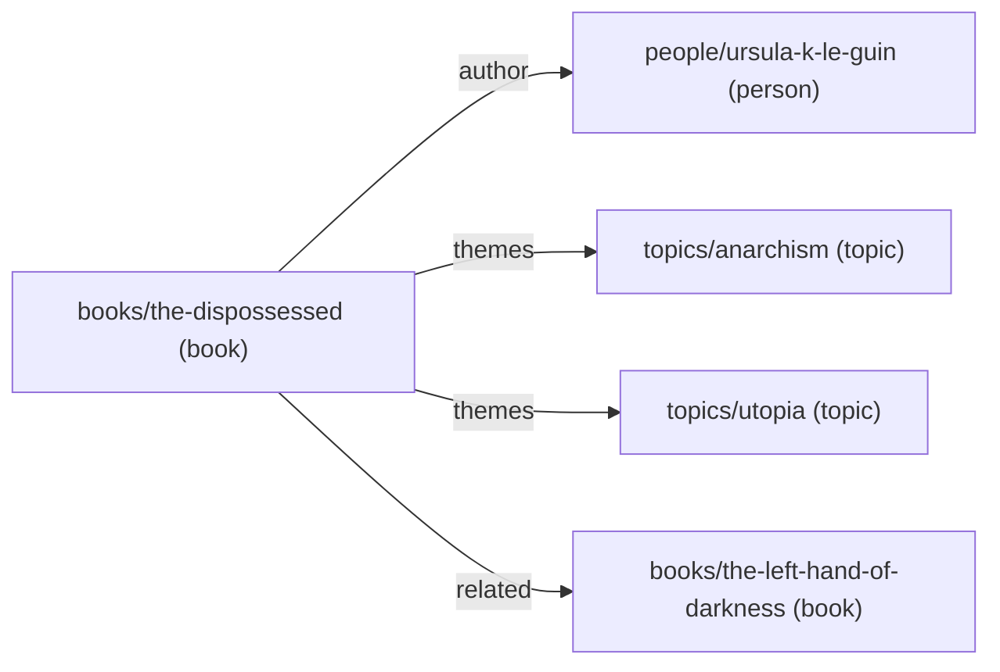
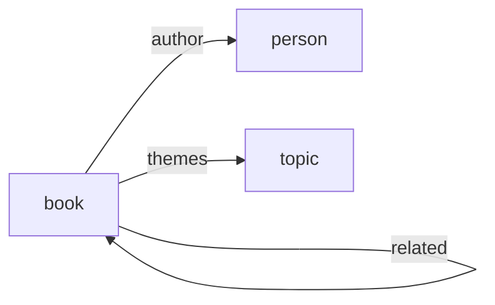

> **tldr**; this is about a tool I wrote called [smolbren](https://github.com/junaidrahim/smolbren) to make
> ontology-driven agentic search faster and token-efficient over my obsidian vault (~13k notes).

If you've set up an LLM driven knowledge base[^1], one of the very first things you ask your agent to do is to go over
your vault and come up with some sort of a schema, a set of types for the documents that go into your vault.

You might write it as a skill or just add it as a prompt that whenever you are processing a bunch of text, try to figure
out what type should be attached to this note.

Types would be things like `recipe`, `idea`, `algorithm`, `essay`, `person`, `company`, `device`, `book` etc.

This is what enables your agent to make organising decisions, and that was the essence of Karpathy's post, to hand over
most of the admin work of maintaining a knowledge base to an agent by writing down these principles in skills or
prompts.

After you have types in your vault, and you are using something like Obsidian that allows wikilinks between notes, you
can also define how edges should be created between the notes.

What you just did is define an [ontology](<https://en.wikipedia.org/wiki/Ontology_(information_science)>) for your
vault, and agents love ontologies, it allows them to independently reason how to organise ingested documents.

You can also add instructions on how to expand this ontology if new notes are ingested that don't squarely fit in a
given type or relationship.

I also did the same. This is what a note in my vault looks like now.

```markdown
---
type: book
status: reading
started: 2026-06-01
author: "[[people/ursula-k-le-guin]]"
themes: ["[[topics/anarchism]]", "[[topics/utopia]]"]
related: ["[[books/the-left-hand-of-darkness]]"]
---

# The Dispossessed

An ambiguous utopia: two worlds, one wall, and the physicist who tries to unbuild it. ...
```

I used markdown frontmatter to encode all the things that are required for the ontology, the `type` key denotes the type
of the note and relationships are arbitrary keys with list of wikilinks.

This is what the graph for this note and its linked notes looks like.



And zooming out from the note, this is what the ontology itself looks like -- the types and the relationships allowed
between them.



I also clip a lot of web articles using the obsidian web clipper and I frequently ask agents to research a topic and
keep a few markdown files ready for me to review, naturally my vault grew by ~6x in terms of number of notes.

## Introducing `smolbren`

All this agent generated markdown volume was wasting a lot of tokens while doing searches, I often found higher latency
for questions which involved querying multiple types and relationships.

So I decided to solve this problem by introducing a sort of ontology-aware search layer. Something that would run
locally and fast and that could crawl the frontmatter and the markdown content and build an index that would help me do
graph queries (cypher), along with BM25 and vector search (using local models).

I named it `smolbren`, because it's truly a very small brain that you can add to your agent setups and let the agent use
it in specific ways to make search more token efficient.

`smolbren` is written in rust using lancedb for storage and lance-graph for implementing the Cypher query language, I
used a quantized ONNX build of [EmbeddingGemma-300M](https://huggingface.co/onnx-community/embeddinggemma-300m-ONNX) for
vector embeddings.

You can read the docs at [smolbren.com](https://smolbren.com/). Or you can give the following prompt to your agent

```markdown
Read the docs at https://smolbren.com, mainly the installation and quickstart pages, and set up smolbren on this machine
for my markdown vault.

1. Check the prerequisites first -- a Rust toolchain (1.85+) and protoc on PATH. Install whatever is missing (rustup for
   Rust, `brew install protobuf` on macOS or `apt-get install protobuf-compiler` on Linux).
2. Install it with `cargo install smolbren` and verify with `smolbren --version`.
3. My vault lives at <path-to-your-vault>. Register it with `smolbren vault add personal <path-to-your-vault>` and run
   `smolbren index` followed by `smolbren embed`.
4. Show me the ontology it discovered -- run `smolbren types` and `smolbren edges` and summarize what note types and
   relationships exist in my vault.
5. Sanity check the search: run one `smolbren search` (BM25), one `smolbren similar` (vector) and one `smolbren query`
   (Cypher) that are relevant to my notes and show me the raw output.

If anything fails, read the relevant page on smolbren.com before retrying.
```

This is ideal for people like me who don't want to go all-in on a setup like
[gbrain](https://github.com/garrytan/gbrain) which takes all of the control away from you. If you want to still play
around with your own way of doing CRON jobs and setting up your dreaming sequence, you can ask your agent to use
`smolbren` in a variety of different ways.

### Performance

Test Setup: 5,000-note vault, 15,000 links.

| Query                                                           | smolbren Cypher (1 call) | grep (agent ingests) |
| --------------------------------------------------------------- | ------------------------ | -------------------- |
| How many projects have a blog linking to them?                  | **198ms / 37 B**         | 611 KB over 2+ calls |
| What does note X mention, with titles?                          | **211ms / 206 B**        | 2 KB over 2+ calls   |
| Top-5 most-mentioned people                                     | **208ms / 205 B**        | 826 KB over 1+ calls |
| How many projects are mentioned by both a blog _and_ a journal? | **320ms / 37 B**         | 719 KB over 2+ calls |
| Who links to note Y, and what type is each?                     | **198ms / 136 B**        | 1 KB over 2+ calls   |

The first row, for example, is a single call:

```sh
smolbren query "MATCH (b:blog)-[:mentions]->(p:project) RETURN count(DISTINCT p.id)"
```

To put numbers on this I generated a 5,000-note vault with 15,000 links between notes and asked five questions that need
the graph.

The smolbren column is a single Cypher query per question. The grep column is what an agent has to pull into its context
window to answer the same question with ripgrep: list the candidate files first, then fetch their frontmatter lines,
then do the join itself[^2].

Nothing about that loop is hypothetical, it's what Claude does in my sessions when all it has is a file tree and a
search tool. Medians over 7 runs, release builds, M-series MacBook.

## In Conclusion

My hermes agent, a cron job on my mac mini, now uses smolbren to rip through my obsidian vault and make sure that things
are as per the ontology, and if needed it grows the ontology on its own.

This is a very different approach from most of the advice on setting up a knowledge base, which is to give up all of the
control to the agents and let them do the ingesting and the writing -- index literally everything you see on your
screen, every notification, email and meeting note, and then ask dumb questions like "oh tell me everything I've read
about this topic".

All that does is undermine the highest signal input the system can get, your own long form writing. Free form writing is
what surfaces the knots in your thinking, all the biases and assumptions. All ideas sound good until you write them
down. Shove everything else in and it's slop in, slop out.

That's also why smolbren stays a small tool and not a platform. Tools should be paint brushes and not hammers, at least
the ones you interact with daily, and they should leave you the freedom to compose your own systems. The same freedom
applies at the model layer, with the amount of flux in the AI models market, building anything that only works with
OpenAI models/harnesses or only Anthropic ones is just stupid. BYOA, bring your own agent. Preserve your data and its
indexes in a way that is fully harness and model agnostic, and you get to reap all the improvements that happen at the
model layer.

---

**Notes**

Special thanks to [Komal Tiwari](https://www.linkedin.com/in/komal-t-b4662119a) and
[Ganesh Futane](https://www.linkedin.com/in/ganeshfutane) for reading drafts of this post and providing feedback.

[^1]: [Andrej Karpathy on LLM Knowledge Bases](https://x.com/karpathy/status/2039805659525644595?s=20)

[^2]:
    Yes, you can often do this in one pipeline and skip the context cost entirely:
    `rg -o '\[\[people/' | sort | uniq -c | head` type stuff. I timed those too and they beat smolbren, 30–150ms. The
    catch is they only worked because I generated this vault to be grep-friendly: every link is a full path like
    `[[projects/note-0042]]` and the folder name always matches the note's type. My real vault has neither. Links look
    like `[[note-0042]]` or `[[note-0042|that search thing]]`, and `type: project` lives in frontmatter while the file
    sits in whatever folder made sense at the time. So to type-check a single link target you have to figure out which
    file it points to and open it. Do that 15,000 times and you've rebuilt an indexer in bash, badly, and it reruns on
    every question.
