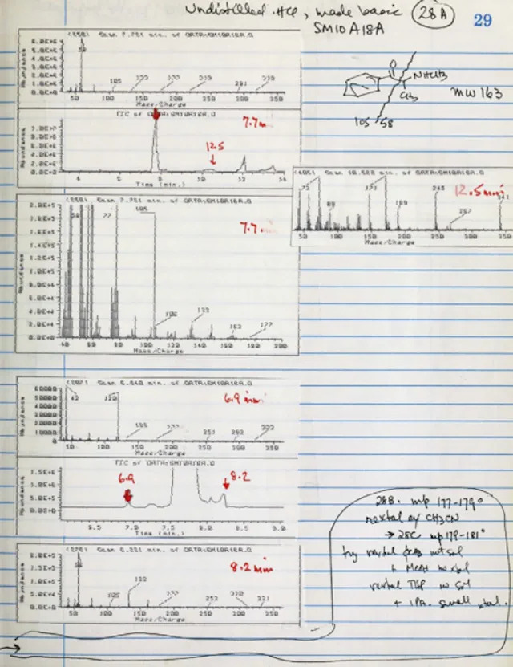

I wanted to write a post about my writing process to transparently disclose where I've used AI to author these blog
posts.

I think it's become abundantly clear that people don't like reading AI-generated posts. Substack launched a full feature
to ensure that people who generate-and-publish their drafts are adequately shamed.[^1]

I used to not be in this camp of unequivocal hate for AI-generated writing, but I have joined it after reading hundreds
of pages of slop at work. Nobody takes any effort anymore to write a document; all design docs and ideas and
emails are full of slop. After a while you just have this allergic reaction to all writing sounding the same, with the
tell-tale signs of whether Claude wrote it or not. People's writing used to be a major interface to understand them and
the way they thought; I used to look forward to reading technical documents from engineers I admired the most. Now it
has all been flattened into one very regurgitative dead center of writing style.

In that case, most writers I respect have sort of stuck to a 100% human-written drafts policy, where they might use AI in
their research and grunt work; they'll use AI to generate charts and all the adjunct work that goes into writing
technical posts, but the final drafts are fully hand-written, so that they are at least fun to read.

Anyway, given all this dilemma, I feel I have struck a fair middle ground where I can still outsource the boring parts of
writing to AI and preserve the most creative parts for me. No, this is not another post about how I have set up a content
machine with a hundred skills to pump more blog posts and tweets. It's actually about a pretty simple setup I have been
using to make sure I can preserve my human writing and bring it front and center, and not have Claude vomit something
that is disrespectful to my readers. It's so simple that I feel like a simpleton taking the effort to write this post.

Personally, I am pretty against that kind of writing. I am sure it makes sense for people who do writing in a more
transactional nature, where the things they write directly lead to dollars, but I don't do that kind of writing.

Most discourse about AI writing is this weird binary where you either let AI write something or you don't, which was
something even I was struggling with, and in the spirit of that problem I think I have come up with a very simple
solution to it: to have AI act as a research assistant in my writing process.

AI tools are very helpful in doing the grunt work of writing, which is researching, collating summaries from sources,
doing wider web searches, and testing multiple arguments for and against the idea or story you're trying to write. I
really enjoy using Claude for that, I do; the amount of rigour you can bring to your writing by offloading the grunt work
is really a lot.

## Organise your writing in Notebooks

All of this is inspired by research notebooks.



Technical writing is fairly research-heavy: you usually start with an idea or a point you have to make, then you search
the web for posts around your idea, you probably write some code, generate some charts, etc. Once you have all these
things, you use them as evidence or visual aids to write your final draft.

Almost all of the AI tools marketed to "help" you write are focused on getting AI to generate the text or edit it. They
either optimise for output quantity or editorial rigour. I tried using these but they are just not the right UX. It's
like trying to edit photos using a hex editor. I want AI to do the grunt work to support and argue about the idea I am
trying to write about, so I, with my bare fingers, token by token, can write a final polished draft that another human
would actually enjoy reading.

And the way I have organised these drafts is like research notebooks: a folder where AI can do whatever it wants in terms
of experiments, drafts, deep research runs, etc., but all those artifacts are isolated to just one section of the
notebook, and then there is a `draft.md` file which the agent is not allowed to touch at all. Just by organising it like
this, you can be sure that all the work the agents are doing is being appended to the other files, which you can review
and consume along with a rich bibliography so that you can read the originals, and then you can incrementally work on the
final draft that you publish yourself.

This is how I've organised notebooks in my Obsidian vault.

```bash
Notebooks/
├── technical/
│   └── <piece>/
└── substack/
    └── <piece>/

<piece>/
├── notebook.md   # shared control surface
├── draft.md      # human prose only
├── sources.md    # verified bibliography
├── research/     # agent-run research streams
└── artifacts/    # reviews, suggestions, figures, experiments
```

I have come to believe that there is no virtue in having AI generate all of the final draft you publish; it usually ends
up being an uninspiring piece of writing, no matter how brilliant the original idea is. Also, my rather selfish intent to
write on this site is to preserve my mental muscle of being able to write.

And with those intents, this sort of notebook-first approach to writing seems to be working out well for me.

You can send this blog post URL to your agent and have it set up this notebook structure for you if you want to try it
out.

I have also been trying to move my actual drafting to pen and paper, while my agent keeps on with the grunt work of
finding relevant sources, articles and other supplementary material for me.

[^1]: [Substack's AI-detection tool, built with Pangram (The Verge)](https://www.theverge.com/ai-artificial-intelligence/968855/substack-pangram-ai-detecting-tool)
