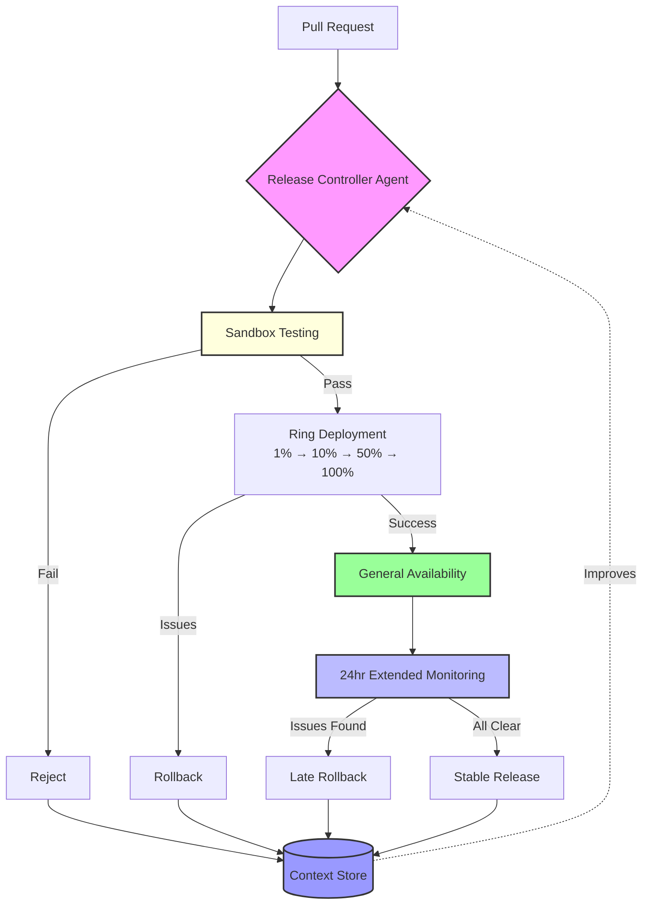

# Modelling Release Controllers as Immune Systems

Date: 2025-08-05

I've been thinking about release controllers lately, and there's something fascinating about viewing them through a biological lens. What if we consider them as the immune system of our software?

The parallel struck me during a recent incident. A seemingly harmless code change slipped through initial checks, then started causing issues across our tenant fleet. The way our release controller detected and rolled back the change - it felt remarkably like an immune response ejecting a pathogen.

## The Living System

Every pull request is essentially a foreign entity entering our ecosystem. Some are beneficial, like the good bacteria in our gut. Others? Potential threats to system stability.

Our release controllers create isolated environments - sandboxes where code can be observed without risk. Just like how our bodies quarantine unknown substances at the cellular level. We monitor metrics, watch for anomalies, learn what's normal and what's not.

But here's what's interesting: the real power isn't in the initial detection. It's in the adaptive response. When code that looked safe starts showing adverse effects in production, the system springs into action. Rapid rollback. Threat neutralized. System health preserved.

## Beyond the Metaphor

This isn't just a useful analogy - it's a design principle. Both biological and software systems share the same fundamental challenge: maintaining stability while allowing growth.

Consider how our immune systems evolved over millions of years. They learned to:

- Distinguish friend from foe with remarkable accuracy
- Respond proportionally to threats
- Remember past encounters
- Balance protection with necessary exposure

Our release controllers are attempting the same thing, just compressed into years instead of millennia.

## The Question That Matters

So here's what I keep coming back to: How do we accelerate this evolution?

Maybe it's about better signal detection - understanding not just if code works, but how it behaves under stress. Maybe it's about smarter learning algorithms that can predict issues before they manifest. Or perhaps it's about building systems that can reason about code changes the way our immune systems reason about molecular structures.

The goal isn't just preventing bad code from entering production. It's creating an environment where innovation can thrive while maintaining the delicate balance of a complex, living system.

Release controllers as immune systems. It's more than metaphor - it's a blueprint for building resilient software ecosystems.

## Diagram

## References

- `projects/ring-based-releases`

---

2026-06-19

The initial seed of this blog post was to ponder about how release tooling should change with the increase in change velocity. People are making too many changes and claude is shipping a lot more. How do you absorb that velocity by rolling out with more scrutiny and care. How do you roll out a bunch of low trust changes and observe them very heavily in prod before you qualify them as stable. 

If more and more data is queryable around a release, agents can make better decisions, and iterate to get to that prod ready trusted state much faster.

